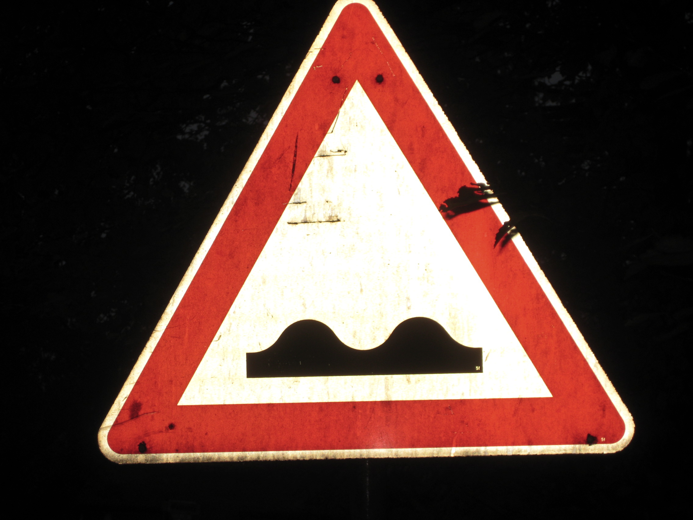

#**Traffic Sign Recognition** 
---

**Build a Traffic Sign Recognition Project**

The goals / steps of this project are the following:
* Load the data set (see below for links to the project data set)
* Explore, summarize and visualize the data set
* Design, train and test a model architecture
* Use the model to make predictions on new images
* Analyze the softmax probabilities of the new images
* Summarize the results with a written report

[//]: # (Image References)

[image1]: ./examples/visualization.jpg "Visualization"
[image2]: ./examples/grayscale.jpg "Grayscaling"
[image3]: ./examples/random_noise.jpg "Random Noise"
[image4]: ./examples/placeholder.png "Traffic Sign 1"
[image5]: ./examples/placeholder.png "Traffic Sign 2"
[image6]: ./examples/placeholder.png "Traffic Sign 3"
[image7]: ./examples/placeholder.png "Traffic Sign 4"
[image8]: ./examples/placeholder.png "Traffic Sign 5"

## Rubric Points
###Here I will consider the [rubric points](https://review.udacity.com/#!/rubrics/481/view) individually and describe how I addressed each point in my implementation.  

---
###Writeup / README

####1. Provide a Writeup / README that includes all the rubric points and how you addressed each one. You can submit your writeup as markdown or pdf. You can use this template as a guide for writing the report. The submission includes the project code.

You're reading it! and here is a link to my [project code](https://github.com/edude03/CarND-Traffic-Sign-Classifier-Project/blob/master/Traffic_Sign_Classifier.ipynb)

###Data Set Summary & Exploration

####1. Provide a basic summary of the data set. In the code, the analysis should be done using python, numpy and/or pandas methods rather than hardcoding results manually.

I used the pandas library to calculate summary statistics of the traffic
signs data set:

* The size of training set is 34,799 examples
* The size of the validation set is 4,410 examples
* The size of test set is 12,630 examples
* The shape of a traffic sign image is 32x32x3
* The number of unique classes/labels in the data set is 43 classes

####2. Include an exploratory visualization of the dataset.

###Design and Test a Model Architecture

For optimization, I decidede to only normalize the data (shift the colour values from 0-255 to 0-1) using the built in tensorflow `per_image_standardization`. I had originally decided I would convert the images to grayscale, but my intuition tells me that the network would perform better with the color data since as humans, the color of a sign gives us a good idea of what kind of sign it is (IE a stop sign is always red)

While normalization seems to make the training run slower (probably due to the fact that I'm mapping over the training data with a lambda) I found that this improved the accuracy and time for the network to converge.

My final network was a slightly modified version of the LeNet network we used in the LeNet Lab. I modified the input strides to be `[5,5,3,6]` as opposed to `[5,5,1,6]` as the traffic signs have 3 channels/layers (RGB) instead of one like the grayscale handwriting data.

Furthermore, I changed the last fully connected layer to have an output shape of `(84, 43)` instead of `(84,10)` as there are 43 classes in this training set.

My final model consisted of the following layers:

| Layer         		|     Description	        					| 
|:---------------------:|:---------------------------------------------:| 
| Input         		| 32x32x3 RGB image   							| 
| Convolution 3x3     	| 1x1 stride, same valid padding, outputs 28x28x6| 
| RELU					| Rectified Linear Unit		                    |
| Max pooling	      	| 2x2 stride,  outputs 16x16x64 				|
| Convolution 3x3	    | 1x1 stride, same valid padding, outputs 10x10x16      									|
| RELU					| Rectified Linear Unit		                    |
| Max pooling	      	| 2x2 stride,  outputs 5x5x16                   |
| Fully connected		| Input 400, Output 120        					|
| ReLU                  | Rectified Linear Unit                         |
| Dropout               | Droput w/ 50% Keep Probability                |
| Fully connected		| Input 400, Output 120        					|
| ReLU                  | Rectified Linear Unit                         |
| Dropout               | Droput w/ 50% Keep Probability                |
| Fully connected		| Input 400, Output 120        					|

####3. Describe how you trained your model. The discussion can include the type of optimizer, the batch size, number of epochs and any hyperparameters such as learning rate.

To train the model, I used the built in TensorFlow Adam optimizer. Intially I used a batch size of 128 and a learning rate of 0.001 however I found after 50 epochs the network accuracy was under 10% on both the training and validation set. I found that bumping up the batch size to 256 increased the training accuracy to about 14% after the same number of epochs. 

Since I was training on a GPU (A Maxwell Nvidia Titan X) I decided to bump the batch size up to 2048, the number of epochs to 100 and the learing rate to 0.01. I found that this values where optimal for the GPU as it could hold large batches in memory, which speed up the training time. Furthremore, I found that higher learning rates caused lower accuracy, whereas lower training rates took too long to converge. 

####4. Describe the approach taken for finding a solution and getting the validation set accuracy to be at least 0.93. Include in the discussion the results on the training, validation and test sets and where in the code these were calculated. Your approach may have been an iterative process, in which case, outline the steps you took to get to the final solution and why you chose those steps. Perhaps your solution involved an already well known implementation or architecture. In this case, discuss why you think the architecture is suitable for the current problem.

My final model results were:
* training set accuracy of 99.3%
* validation set accuracy of 95.1%
* test set accuracy of %93.4

Initially, I tried a vanilla implementation of LeNet as it was taught in the lectures and I had a felt confident using it on a more advanced dataset. After implementing the "vanilla" version from the I found that I couldn't get the training accuracy over about 83%. While this seemed pretty good, when run on the validation set, I found the validation data set scored 79% which wasn't very good in comparison. At this point, I decided to try implementing normalization, and while it seemed to improve convergence time, and the score by a percent point, it was still not the 90% I was aiming for. 

My intution was that the difference in scores was due to the network overfitting the training data, and thus I decided to implement dropout on the first two fully connected layers of LeNet to reinforce the networks ability to generalize. 

This, plus normalization, plus shuffling the data set before feeding it to training boosted the training accuracy to 99.3 after 30 epochs, and the validation accuracy to 95.1%. 
 

###Test a Model on New Images

####1. Choose five German traffic signs found on the web and provide them in the report. For each image, discuss what quality or qualities might be difficult to classify.

Here are five German traffic signs that I found on the web:

The first image should be pretty easy for the neural net as it is well lit, well focused, and centered. As expected the NN successfully classifies this image as a stop sign.

The second image as well, should be easily classified, and it is.

The third image may be tricky as it is not as well focused in as the other images; the sign is further back. While the NN is only 86% sure, it successfully categorized the image as a 50 KM/h sign.

The bumpy road sign, as a human I feel like is hard to classify, as the image isn't very clear, however the DNN pulls off a successful classification with a confidence of 96%

The Road Work sign was as well successfully classified.

The Pedestrian Image as as well successfully classified.

####2. Discuss the model's predictions on these new traffic signs and compare the results to predicting on the test set. At a minimum, discuss what the predictions were, the accuracy on these new predictions, and compare the accuracy to the accuracy on the test set (OPTIONAL: Discuss the results in more detail as described in the "Stand Out Suggestions" part of the rubric).

Here are the results of the prediction:

| Image			        |     Prediction	        					| 
|:---------------------:|:---------------------------------------------:| 
| Stop Sign      		| Stop sign   									| 
| General Caution     			| General Caution 										|
| Speed Limit (50)					| Speed Limit (50)											|
| Bumpy Road	      		| Bumpy Road					 				|
| Road Work | Road Work |
| Pedestrians			| Pedestrians      							|

The model was able to achieve 100% accurracy with the 5 images. Compared to the 93% accurracy on the test set I assume that the images I picked where too easy for it.

####3. Describe how certain the model is when predicting on each of the five new images by looking at the softmax probabilities for each prediction. Provide the top 5 softmax probabilities for each image along with the sign type of each probability. 

The code for making predictions on my final model is located in the 11th cell of the Ipython notebook.

For the first image the Top 5 Probable classes are:
Stop, with probability of 99.987%
Yield, with probability of 0.007%
No entry, with probability of 0.002%
Speed limit (80km/h), with probability of 0.001%
Road work, with probability of 0.001%

For the second image the top 5 Probable classes are:
General caution, with probability of 99.992%
Traffic signals, with probability of 0.006%
Pedestrians, with probability of 0.001%
Road narrows on the right, with probability of 0.000%
Bumpy road, with probability of 0.000%

For the third image the top 5 Probable classes are:
Speed limit (50km/h), with probability of 86.162%
Speed limit (30km/h), with probability of 13.744%
Speed limit (80km/h), with probability of 0.091%
Speed limit (100km/h), with probability of 0.003%
End of speed limit (80km/h), with probability of 0.000%

For the forth image the top 5 Probable classes are:
Bumpy road, with probability of 96.772%
Bicycles crossing, with probability of 2.320%
Road work, with probability of 0.515%
Wild animals crossing, with probability of 0.115%
Children crossing, with probability of 0.094%

For the fifth image the top  5 Probable classes are:
Road work, with probability of 94.033%
Bicycles crossing, with probability of 2.939%
Wild animals crossing, with probability of 2.224%
Bumpy road, with probability of 0.488%
Beware of ice/snow, with probability of 0.149%

For the 6th image the top 5 Probable classes are:
Pedestrians, with probability of 43.720%
General caution, with probability of 26.552%
Road narrows on the right, with probability of 14.235%
Right-of-way at the next intersection, with probability of 11.750%
Bicycles crossing, with probability of 2.500%
